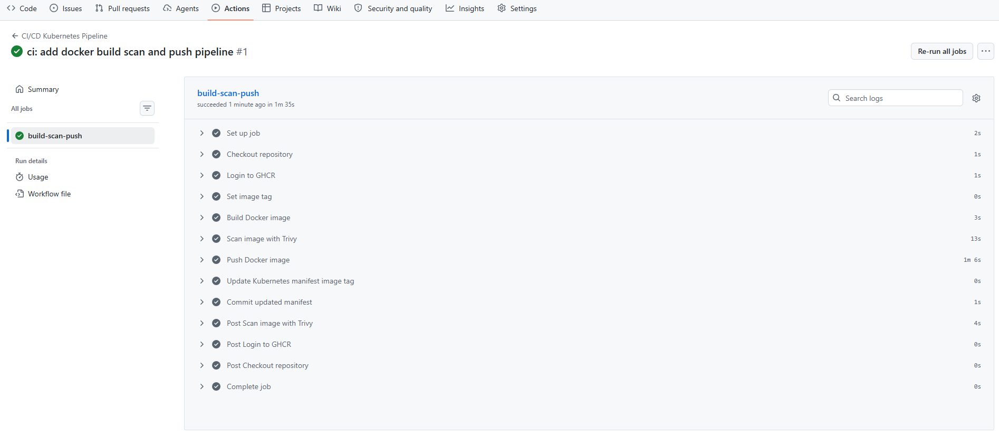
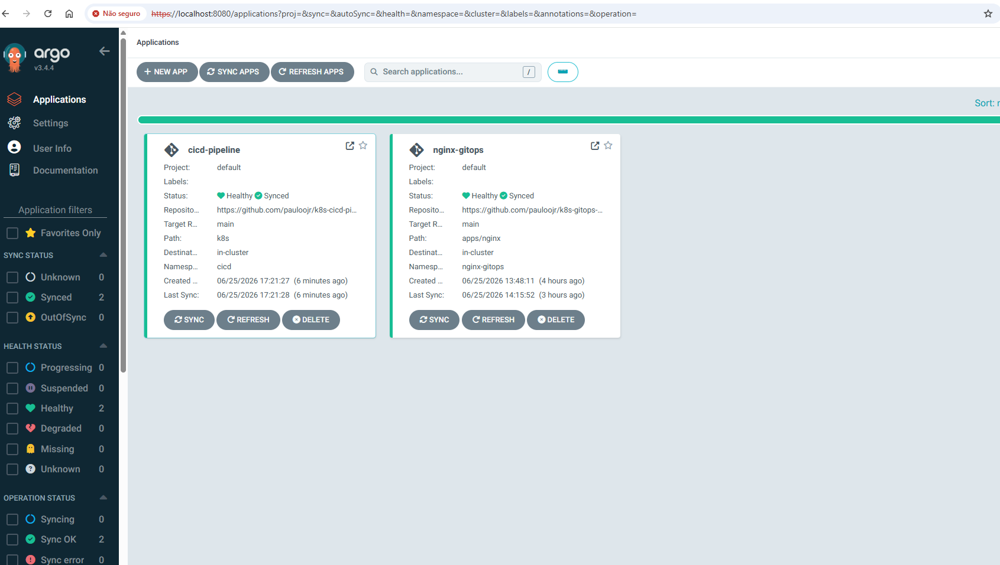
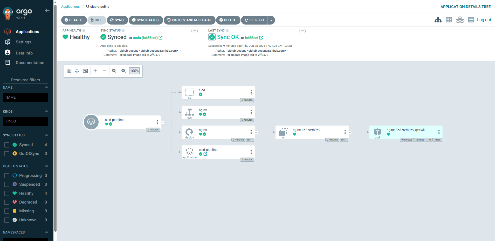
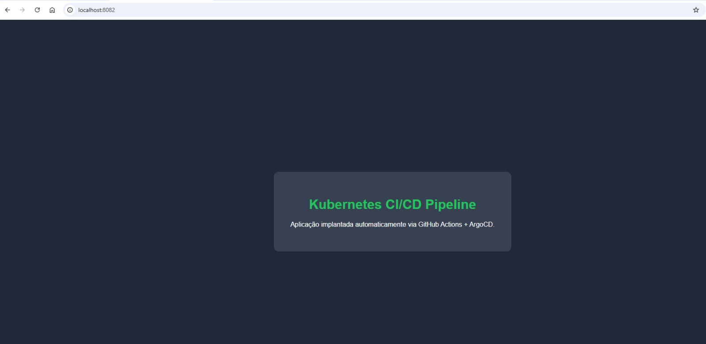

# Kubernetes CI/CD Pipeline

Pipeline completo de CI/CD para Kubernetes utilizando **GitHub Actions**, **Docker**, **GitHub Container Registry (GHCR)**, **Trivy**, **ArgoCD** e **Kind**.

Este projeto demonstra um fluxo GitOps onde cada alteração enviada ao repositório gera automaticamente uma nova imagem Docker, realiza análise de vulnerabilidades, publica a imagem no GHCR e atualiza automaticamente o cluster Kubernetes através do ArgoCD.

---

# Objetivo

Demonstrar uma pipeline CI/CD moderna para ambientes Kubernetes utilizando práticas DevOps e GitOps.

Fluxo implementado:

```
Developer
     │
     ▼
GitHub Push
     │
     ▼
GitHub Actions
     │
     ├── Build Docker Image
     ├── Security Scan (Trivy)
     ├── Push para GHCR
     └── Atualiza Deployment
               │
               ▼
GitHub Repository
               │
               ▼
ArgoCD
               │
               ▼
Kubernetes Cluster
               │
               ▼
Aplicação Atualizada
```

---

# Tecnologias utilizadas

- Kubernetes (Kind)
- Docker
- GitHub Actions
- GitHub Container Registry (GHCR)
- ArgoCD
- Trivy
- YAML
- GitOps
- CI/CD

---

# Estrutura do projeto

```
k8s-cicd-pipeline/
│
├── .github/
│   └── workflows/
│       └── ci.yml
│
├── app/
│   └── index.html
│
├── k8s/
│   ├── application.yaml
│   ├── deployment.yaml
│   ├── namespace.yaml
│   └── service.yaml
│
├── screenshots/
│
├── Dockerfile
└── README.md
```

---

# Pipeline CI/CD

Sempre que ocorre um **push** para a branch **main**, o GitHub Actions executa automaticamente:

1. Checkout do código
2. Build da imagem Docker
3. Scan de vulnerabilidades com Trivy
4. Push da imagem para o GitHub Container Registry
5. Atualização automática do Deployment Kubernetes
6. Commit da nova tag da imagem
7. ArgoCD detecta a alteração
8. Sincronização automática do cluster

---

# Arquitetura

```
                GitHub

                   │
                   ▼

          GitHub Actions
        Build + Security Scan

                   │
                   ▼

      GitHub Container Registry

                   │
                   ▼

          Kubernetes Manifest

                   │
                   ▼

              ArgoCD

                   │
                   ▼

            Kubernetes

                   │
                   ▼

          Aplicação Atualizada
```

---

# Screenshots

## Pipeline GitHub Actions



---

## ArgoCD sincronizado

Aplicação sincronizada automaticamente após atualização da imagem.



---

## Topologia da aplicação

Visualização dos recursos Kubernetes gerenciados pelo ArgoCD.



---

## Aplicação publicada

Aplicação executando no cluster Kubernetes.



---

# Como executar

## Clonar

```bash
git clone https://github.com/pauloojr/k8s-cicd-pipeline.git

cd k8s-cicd-pipeline
```

---

## Criar cluster Kind

```bash
kind create cluster --name devops-lab
```

---

## Instalar ArgoCD

```bash
kubectl create namespace argocd

helm repo add argo https://argoproj.github.io/argo-helm

helm repo update

helm install argocd argo/argo-cd \
-n argocd \
--create-namespace
```

---

## Criar a aplicação

```bash
kubectl apply -f k8s/application.yaml
```

---

## Acessar o ArgoCD

```bash
kubectl port-forward svc/argocd-server -n argocd 8080:443
```

Abrir:

```
https://localhost:8080
```

---

## Acessar a aplicação

```bash
kubectl port-forward svc/nginx -n cicd 8082:80
```

Abrir:

```
http://localhost:8082
```

---

# Fluxo GitOps

```
Push no GitHub

        │

        ▼

GitHub Actions

        │

        ▼

Nova imagem Docker

        │

        ▼

Atualização do Deployment

        │

        ▼

ArgoCD detecta alteração

        │

        ▼

Deploy automático

        │

        ▼

Kubernetes atualizado
```

---

# Resultados

- Pipeline CI/CD automatizada
- Build Docker automatizado
- Scan de vulnerabilidades com Trivy
- Publicação automática no GHCR
- Atualização automática dos manifests
- GitOps utilizando ArgoCD
- Deploy automático no Kubernetes
- Sincronização contínua do cluster

---

# Próximos passos

- Deploy em Amazon EKS
- Deploy em Azure AKS
- Helm Charts
- Kustomize
- Rollback automatizado
- Canary Deploy
- Blue/Green Deployment
- Notificações Slack
- Testes automatizados
- Monitoramento com Prometheus e Grafana

---

# Autor

**Paulo Júnior**

DevOps | Kubernetes | Docker | GitHub Actions | GitOps | ArgoCD | AWS | Azure | Terraform